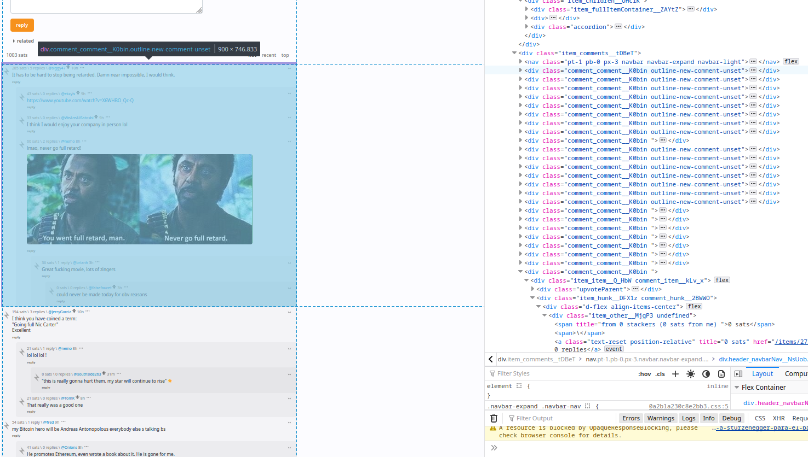
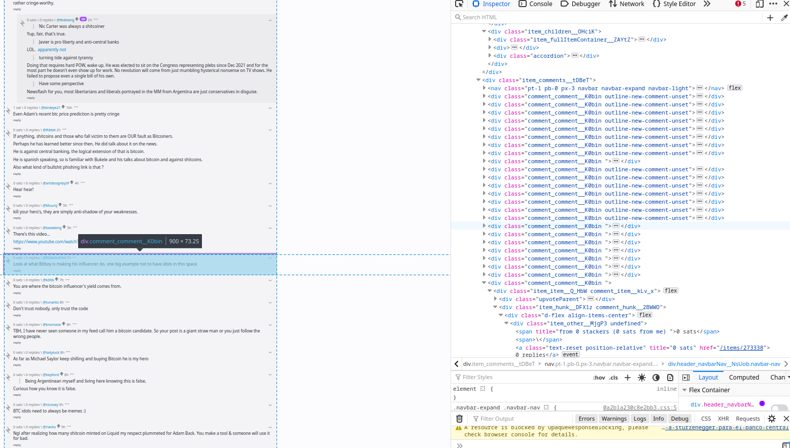

# Stacker News webscraping

## Data to collect

### User data

In a 'profile' the user data available are:

- **username** -> better call it `nym`, in fact user are identified by pseudonyms
- **stacked amount** -> sats received from the account creation
- **lnaddress** -> sort of an email address where users can be paid easily. Most of lnaddresses are provided from custodial services.
- **Stacking since** -> post number of the user's bio. The user bio is considered a post and once someone creates the account it's suggested to post a bio. There could be users without it(?)
- **Longest cowboy streak** -> If a user tip 100 sats (or more) in a day it gets a cowboy hat
- **Bio** -> User bio. Usually it is the first user post
- **Items** -> number of posts+comments the user did

### Post data

Stacker news has 5 typologies of posts that we could find + 1 typology which is `comment`. The five typologies are:
1. Discussion
2. Link
3. Poll
4. Bounty
5. Job

- **Post ID** -> it is unique and progressively named starting from 1, which was posted 11/06/2021. **To scrape post data is probably enough to take the URL and loop it from stacker.news/items/1 to stacker.news/items/n** where N is the greater number that you can put there without receiving a 404 response. With this we can then scrape every post page, catching all the posts, users, comments and users that commented, the stacked amounts. Having all the users names we then can scrape trough all the links stacker.news/`username`. This process can let us catch aso all the users (at least all the users that posted at least once.

> This flow let us skip the process of finding outh the right dynamics for scraping the content behind the 'more' button, since starting from 0 can easily let us scan through all posts.

- **Post title** -> **title is compulsory**
- **Boost value** -> 'Boosts allow stackers to increase the ranking of their post upon creation to give their content more visibility.' (from the FAQ) NB-> **I'm not scraping it at the moment** 
- **Bounty item** -> not all the posts have it. A bounty item is a bounty that the post creator pays to the user that solves its problem/challenge/answers better etc. This amount is retrievable by the green button below the post, where we can both find the amount and the value 'paid' or 'not paid'(?).
- **Post link** -> users can insert a link as a post. This occupies a specific slot in the post template
- **amount stacked** -> amount stacked by the post (in sats). This section provides us also a string that indicates how many users donated in total (es 'from 11 stackers > 212 sats')
- **Number of comments**
- **user that created the post**
- **time stamp** -> YYYY-mm-dd h:m:s
- **post tag** -> **Post tag is compulsory**. Stacker.news provides a fixed amount of tags that the creator can put on the post to classify the post on the different sections of the website feed
- **related posts** -> posts classified as 'related' (I don't know the criteria). This entries sit behind a drop-down menù so maybe more different to catch.
- **total amount stacked by the comments** -> total sum of sats sacked by the users that commented the post
- **Comments** -> 'first level comments' have all their dedicated `
 visitors` but its aggregated data.

- Stacked amounts in posts and comments are represented in units, but once they reach the thousands they are formatted as `10.5k sats`, for millions sats they are `10.5m sats`.

- #### Comments structure

*Comments that have replies*

*Comments that do not have replies*

### Ideas

- We could truncate the linked links and see to which websites the liks refer to
- Do we want to consider 'comments' and 'replies to comments' as the same thing? Where 'comment' is a post that replies to the **starting post**, whereas the 'reply' is the comment to a comment (so a comment to a post that is a comment of the original post) etc. If we decided to treat them as equal, then the scraping of comments is basically a simple command in which we take the `<a class="text-reset position-relative" href="/items/<number>`, that is the same for every comment. This html position contains the ID of the comment in the general history of items. If we decided to **not treat them as equal (which is more correct from a network standpoint) we should plan how to crawl the data in a hierarchy.
