# Social Network Analysis of stacker.news forum

## Periods

### Graphical evolution

|2021-06-01 -> 2021-12-31|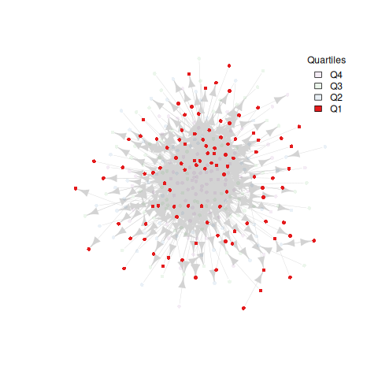|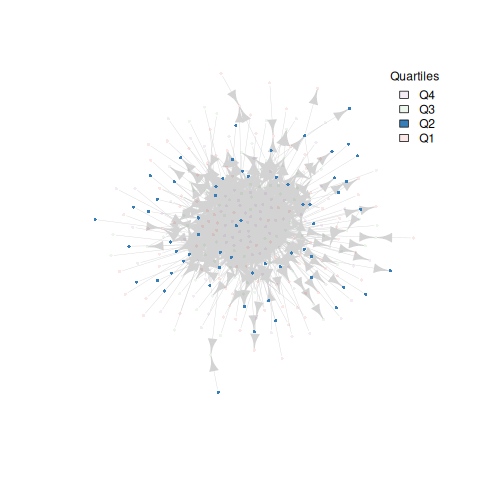|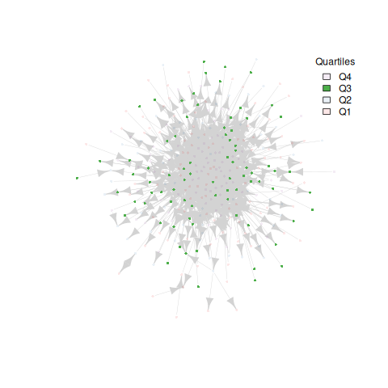|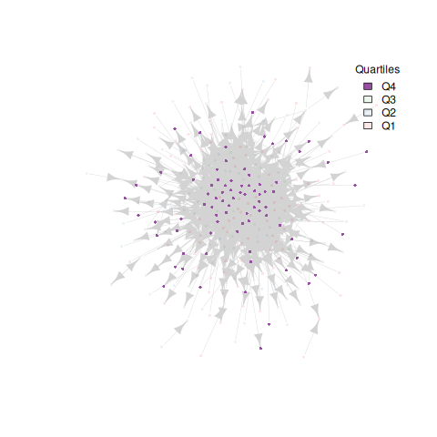|
|---|---|---|---|---|
|2022-01-01 -> 2022-05-31||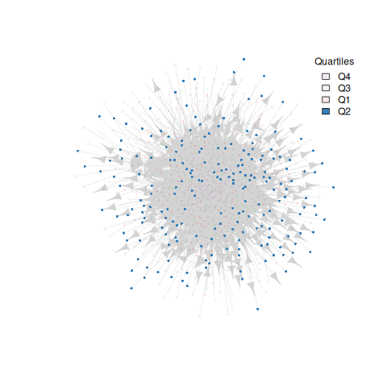|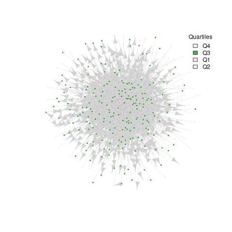|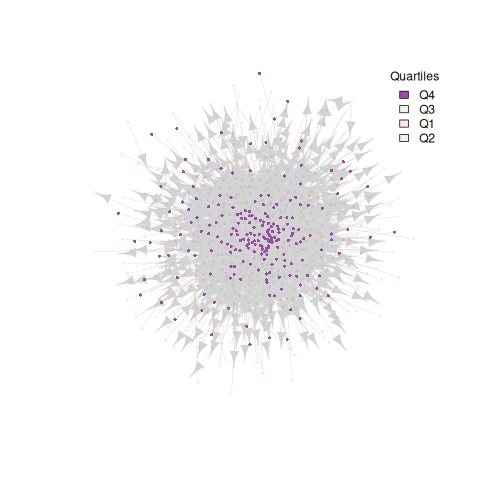|
|2022-06-01 -> 2022-12-31|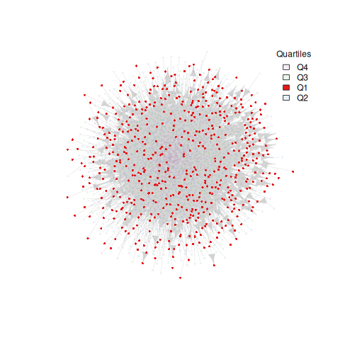|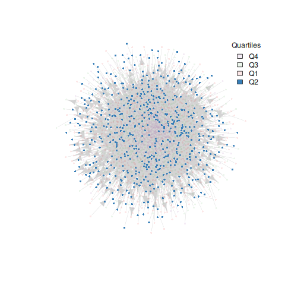|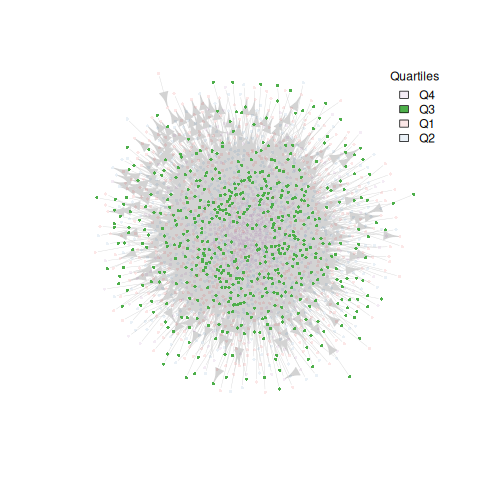|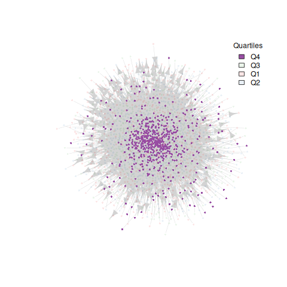|
|2023-01-01 -> 2023-05-31|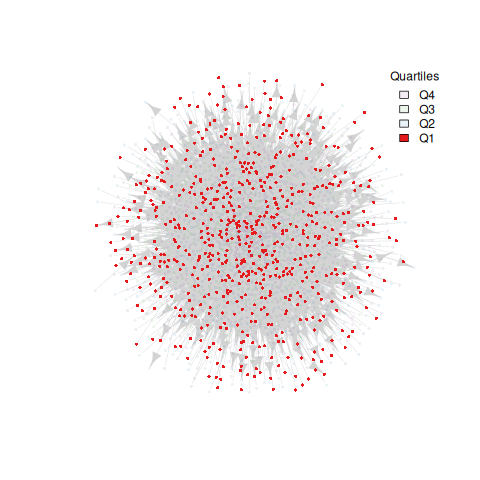|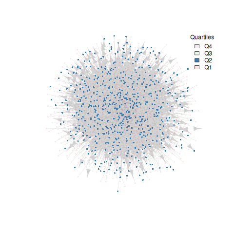|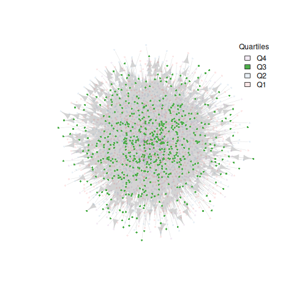|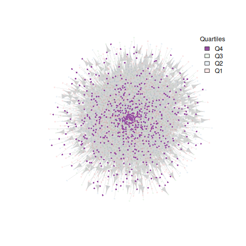|
|2023-06-01 -> 2023-12-31||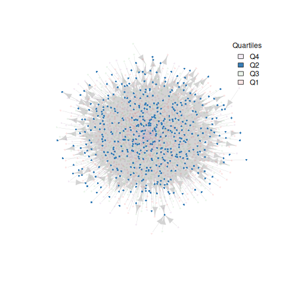|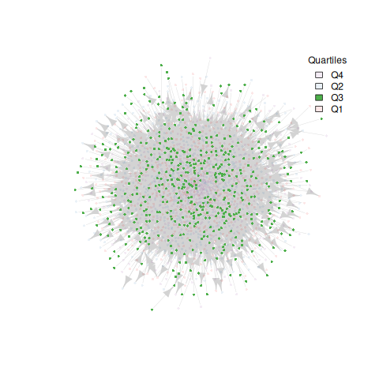|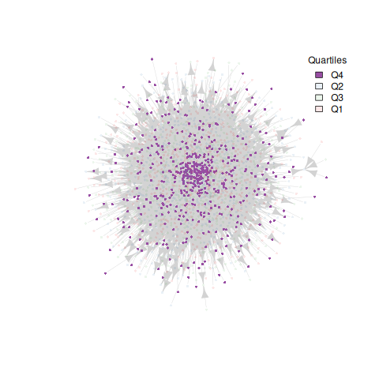|

### Analysis

#### Degree distribution

##### First period

**TOTAL DEGREE TABLE**

|   | author      | in_degr | out_degr | tot_degr |
|---|-------------|---------|----------|----------|
| 1 | k00b        | 152     | 171      | 323      |
| 2 | nout        | 77      | 77       | 154      |
| 3 | DarthCoin   | 49      | 52       | 101      |
| 4 | ugmug       | 40      | 47       | 87       |
| 5 | dergigi     | 48      | 38       | 86       |
| 6 | gmd         | 38      | 44       | 82       |
| 7 | relc        | 28      | 50       | 78       |
| 8 | CypherPoet  | 53      | 24       | 77       |
| 9 | jimmysong   | 47      | 28       | 75       |
|10 | g4ala       | 32      | 35       | 67       |

-   Mean degree: 10.38037
-   Median degree: 3

**IN-DEGREE TABLE**

|   | author      | in_degr | out_degr | tot_degr |
|---|-------------|---------|----------|----------|
| 1 | k00b        | 152     | 171      | 323      |
| 2 | nout        | 77      | 77       | 154      |
| 3 | CypherPoet  | 53      | 24       | 77       |
| 4 | DarthCoin   | 49      | 52       | 101      |
| 5 | dergigi     | 48      | 38       | 86       |
| 6 | jimmysong   | 47      | 28       | 75       |
| 7 | ugmug       | 40      | 47       | 87       |
| 8 | gmd         | 38      | 44       | 82       |
| 9 | g4ala       | 32      | 35       | 67       |
|10 | relc        | 28      | 50       | 78       |

- Mean degree: 5.190184
- Median degree: 1

**OUT-DEGREE TABLE**

|   | author      | in_degr | out_degr | tot_degr |
|---|-------------|---------|----------|----------|
| 1 | k00b        | 152     | 171      | 323      |
| 2 | nout        | 77      | 77       | 154      |
| 3 | DarthCoin   | 49      | 52       | 101      |
| 4 | relc        | 28      | 50       | 78       |
| 5 | ugmug       | 40      | 47       | 87       |
| 6 | gmd         | 38      | 44       | 82       |
| 7 | dergigi     | 48      | 38       | 86       |
| 8 | g4ala       | 32      | 35       | 67       |
| 9 | ThrillerX   | 20      | 32       | 52       |
|10 | jimmysong   | 47      | 28       | 75       |

- Mean degree: 5.190184
- Median degree: 1

**CONTRIBUTORS DEGREE**

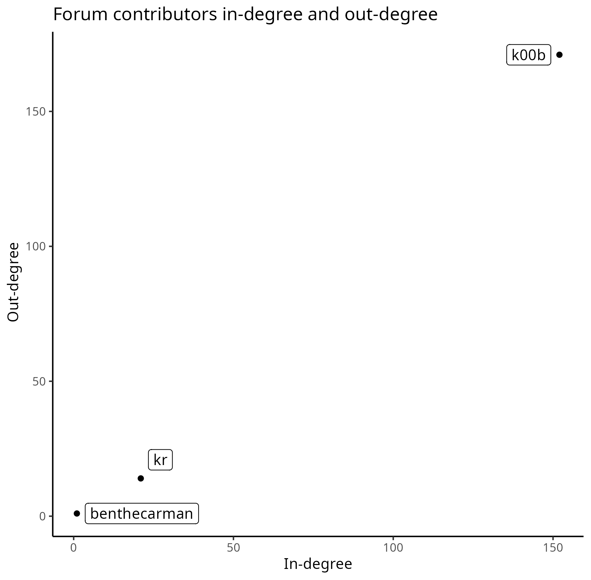

##### Second period

**TOTAL DEGREE TABLE**

|   | author        | in_degr | out_degr | tot_degr |
|---|---------------|---------|----------|----------|
| 1 | k00b          | 287     | 354      | 641      |
| 2 | DarthCoin     | 188     | 218      | 406      |
| 3 | nout          | 172     | 215      | 387      |
| 4 | cryptocoin    | 158     | 200      | 358      |
| 5 | TheBTCManual  | 91      | 151      | 242      |
| 6 | zuspotirko    | 98      | 128      | 226      |
| 7 | kr            | 132     | 89       | 221      |
| 8 | cointastical  | 104     | 112      | 216      |
| 9 | Majjin        | 75      | 115      | 190      |
|10 | kilianbuhn    | 88      | 102      | 190      |

-   Mean degree: 19.88305
-   Median degree: 4

**IN-DEGREE TABLE**

|   | author        | in_degr | out_degr | tot_degr |
|---|---------------|---------|----------|----------|
| 1 | k00b          | 287     | 354      | 641      |
| 2 | DarthCoin     | 188     | 218      | 406      |
| 3 | nout          | 172     | 215      | 387      |
| 4 | cryptocoin    | 158     | 200      | 358      |
| 5 | saloon        | 153     | 0        | 153      |
| 6 | kr            | 132     | 89       | 221      |
| 7 | UlfMoby       | 114     | 64       | 178      |
| 8 | CypherPoet    | 108     | 33       | 141      |
| 9 | cointastical  | 104     | 112      | 216      |
|10 | zuspotirko    | 98      | 128      | 226      |

- Mean degree: 9.941527
- Median degree: 2

**OUT-DEGREE TABLE**

|   | author        | in_degr | out_degr | tot_degr |
|---|---------------|---------|----------|----------|
| 1 | k00b          | 287     | 354      | 641      |
| 2 | DarthCoin     | 188     | 218      | 406      |
| 3 | nout          | 172     | 215      | 387      |
| 4 | cryptocoin    | 158     | 200      | 358      |
| 5 | TheBTCManual  | 91      | 151      | 242      |
| 6 | zuspotirko    | 98      | 128      | 226      |
| 7 | Majjin        | 75      | 115      | 190      |
| 8 | cointastical  | 104     | 112      | 216      |
| 9 | BlokchainB    | 83      | 106      | 189      |
|10 | kilianbuhn    | 88      | 102      | 190      |

- Mean degree: 9.941527
- Median degree: 2

**CONTRIBUTORS DEGREE**

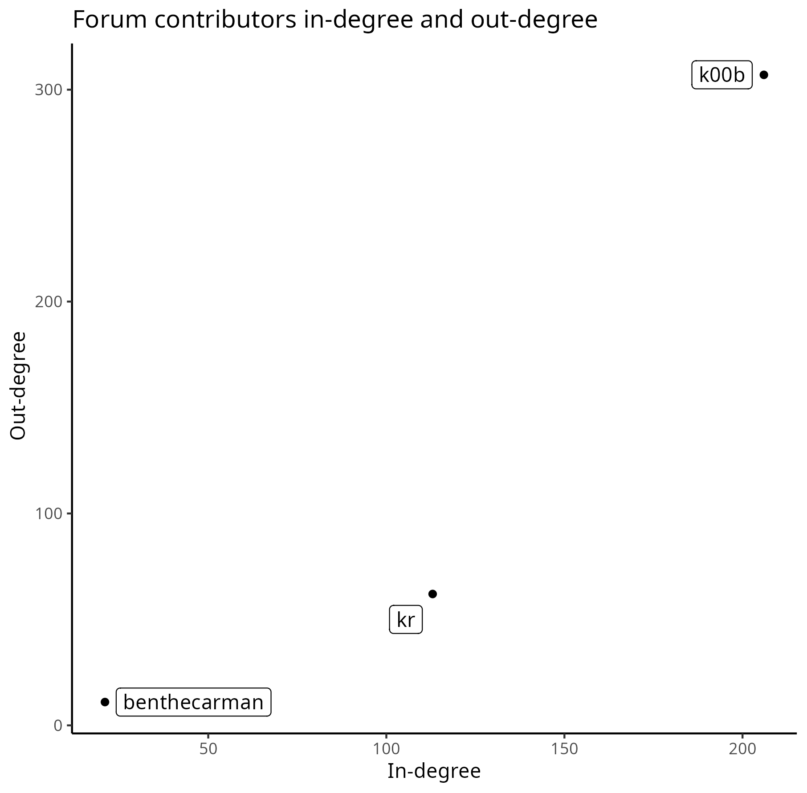

##### Third period

**TOTAL DEGREE TABLE**

|   | author          | in_degr | out_degr | tot_degr |
|---|-----------------|---------|----------|----------|
| 1 | k00b            | 588     | 617      | 1205     |
| 2 | DarthCoin       | 386     | 537      | 923      |
| 3 | cryptocoin      | 406     | 445      | 851      |
| 4 | kr              | 475     | 248      | 723      |
| 5 | nym             | 38      | 646      | 684      |
| 6 | siggy47         | 267     | 330      | 597      |
| 7 | nerd2ninja      | 231     | 342      | 573      |
| 8 | tomlaies        | 274     | 293      | 567      |
| 9 | faithandcredit  | 238     | 308      | 546      |
|10 | kilianbuhn      | 219     | 291      | 510      |

-   Mean degree: 29.33725
-   Median degree: 5

**IN-DEGREE TABLE**

|   | author          | in_degr | out_degr | tot_degr |
|---|-----------------|---------|----------|----------|
| 1 | k00b            | 588     | 617      | 1205     |
| 2 | kr              | 475     | 248      | 723      |
| 3 | cryptocoin      | 406     | 445      | 851      |
| 4 | DarthCoin       | 386     | 537      | 923      |
| 5 | saloon          | 331     | 0        | 331      |
| 6 | sn              | 325     | 8        | 333      |
| 7 | tomlaies        | 274     | 293      | 567      |
| 8 | siggy47         | 267     | 330      | 597      |
| 9 | faithandcredit  | 238     | 308      | 546      |
|10 | User21000000    | 236     | 158      | 394      |

- Mean degree: 14.66863
- Median degree: 3

**OUT-DEGREE TABLE**

|   | author          | in_degr | out_degr | tot_degr |
|---|-----------------|---------|----------|----------|
| 1 | nym             | 38      | 646      | 684      |
| 2 | k00b            | 588     | 617      | 1205     |
| 3 | DarthCoin       | 386     | 537      | 923      |
| 4 | cryptocoin      | 406     | 445      | 851      |
| 5 | nerd2ninja      | 231     | 342      | 573      |
| 6 | siggy47         | 267     | 330      | 597      |
| 7 | TheBTCManual    | 170     | 316      | 486      |
| 8 | faithandcredit  | 238     | 308      | 546      |
| 9 | selfish         | 77      | 300      | 377      |
|10 | tomlaies        | 274     | 293      | 567      |

- Mean degree: 14.66863
- Median degree: 2

**CONTRIBUTORS DEGREE**

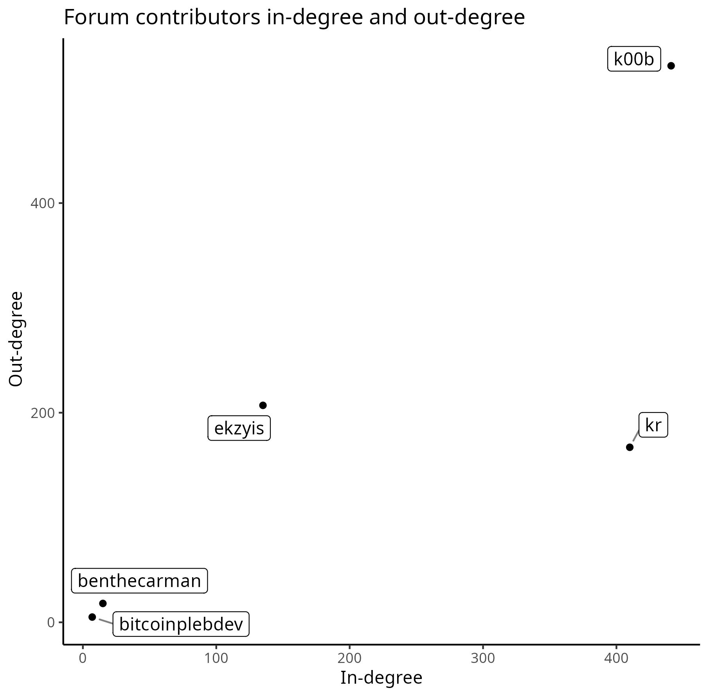

##### Fourth period

**TOTAL DEGREE TABLE**

|   | author             | in_degr | out_degr | tot_degr |
|---|--------------------|---------|----------|----------|
| 1 | DarthCoin          | 576     | 737      | 1313     |
| 2 | siggy47            | 427     | 532      | 959      |
| 3 | k00b               | 394     | 329      | 723      |
| 4 | nym                | 137     | 530      | 667      |
| 5 | ekzyis             | 296     | 322      | 618      |
| 6 | TNStacker          | 164     | 452      | 616      |
| 7 | BitcoinIsTheFuture | 263     | 320      | 583      |
| 8 | kepford            | 163     | 404      | 567      |
| 9 | kr                 | 333     | 226      | 559      |
|10 | sn                 | 507     | 16       | 523      |

-   Mean degree: 24.50309
-   Median degree: 5

**IN-DEGREE TABLE**

|   | author             | in_degr | out_degr | tot_degr |
|---|--------------------|---------|----------|----------|
| 1 | DarthCoin          | 576     | 737      | 1313     |
| 2 | sn                 | 507     | 16       | 523      |
| 3 | siggy47            | 427     | 532      | 959      |
| 4 | k00b               | 394     | 329      | 723      |
| 5 | kr                 | 333     | 226      | 559      |
| 6 | ekzyis             | 296     | 322      | 618      |
| 7 | saloon             | 288     | 0        | 288      |
| 8 | BitcoinIsTheFuture | 263     | 320      | 583      |
| 9 | cryptocoin         | 240     | 223      | 463      |
|10 | grayruby           | 210     | 271      | 481      |

- Mean degree: 12.25155
- Median degree: 3

**OUT-DEGREE TABLE**

|   | author          | in_degr | out_degr | tot_degr |
|---|-----------------|---------|----------|----------|
| 1 | nym             | 38      | 646      | 684      |
| 2 | k00b            | 588     | 617      | 1205     |
| 3 | DarthCoin       | 386     | 537      | 923      |
| 4 | cryptocoin      | 406     | 445      | 851      |
| 5 | nerd2ninja      | 231     | 342      | 573      |
| 6 | siggy47         | 267     | 330      | 597      |
| 7 | TheBTCManual    | 170     | 316      | 486      |
| 8 | faithandcredit  | 238     | 308      | 546      |
| 9 | selfish         | 77      | 300      | 377      |
|10 | tomlaies        | 274     | 293      | 567      |

- Mean degree: 12.25155
- Median degree: 2

**CONTRIBUTORS DEGREE**

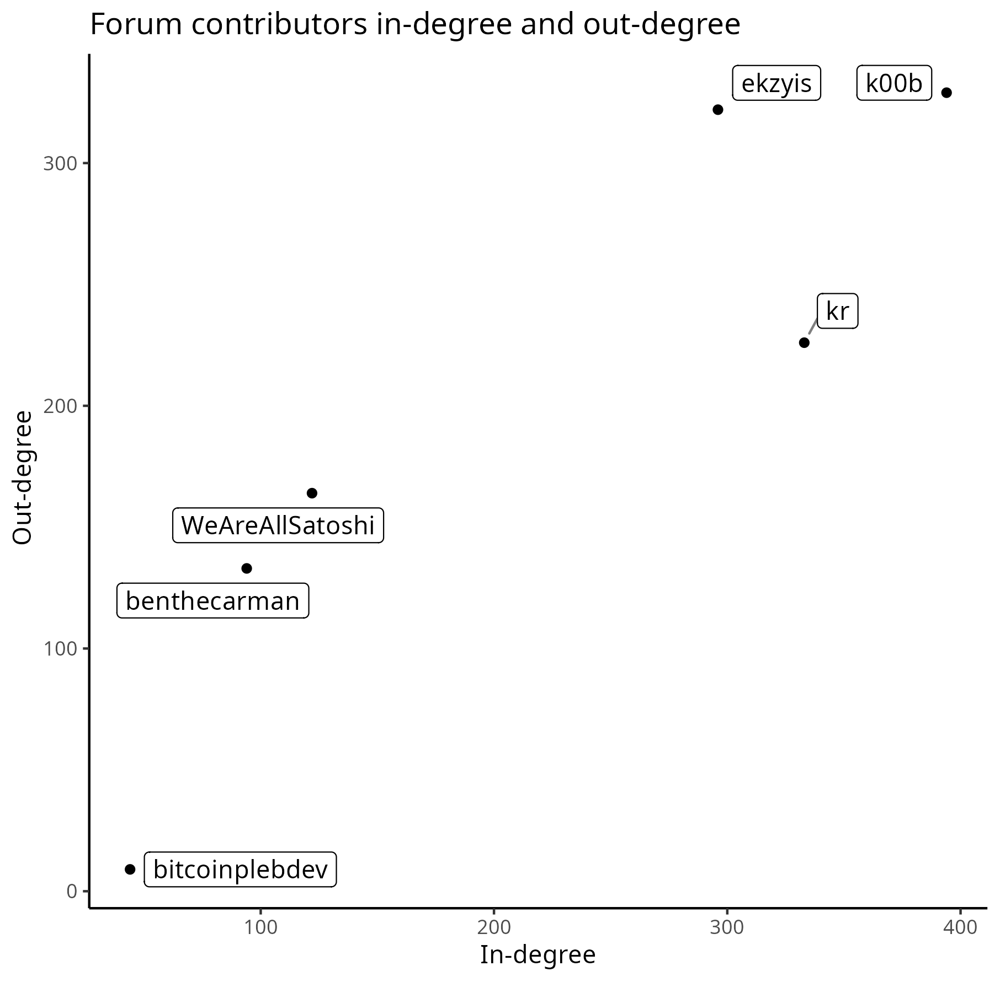

##### Fifth period

**TOTAL DEGREE TABLE**

|   | author       | in_degr | out_degr | tot_degr |
|---|--------------|---------|----------|----------|
| 1 | birdeye21    | 628     | 338      | 966      |
| 2 | DarthCoin    | 393     | 540      | 933      |
| 3 | siggy47      | 387     | 511      | 898      |
| 4 | k00b         | 475     | 404      | 879      |
| 5 | kepford      | 222     | 465      | 687      |
| 6 | ekzyis       | 309     | 318      | 627      |
| 7 | nemo         | 228     | 381      | 609      |
| 8 | sn           | 502     | 19       | 521      |
| 9 | grayruby     | 217     | 261      | 478      |
|10 | mallardshead | 207     | 241      | 448      |

-   Mean degree:31.73962
-   Median degree: 6

**IN-DEGREE TABLE**

|   | author           | in_degr | out_degr | tot_degr |
|---|------------------|---------|----------|----------|
| 1 | birdeye21        | 628     | 338      | 966      |
| 2 | sn               | 502     | 19       | 521      |
| 3 | k00b             | 475     | 404      | 879      |
| 4 | DarthCoin        | 393     | 540      | 933      |
| 5 | siggy47          | 387     | 511      | 898      |
| 6 | ekzyis           | 309     | 318      | 627      |
| 7 | kr               | 270     | 114      | 384      |
| 8 | saloon           | 247     | 1        | 248      |
| 9 | AR0w             | 242     | 60       | 302      |
|10 | Thatfunkymonkey  | 232     | 204      | 436      |

- Mean degree: 15.86981
- Median degree: 3

**OUT-DEGREE TABLE**

|   | author          | in_degr | out_degr | tot_degr |
|---|-----------------|---------|----------|----------|
| 1 | DarthCoin       | 393     | 540      | 933      |
| 2 | siggy47         | 387     | 511      | 898      |
| 3 | kepford         | 222     | 465      | 687      |
| 4 | k00b            | 475     | 404      | 879      |
| 5 | nemo            | 228     | 381      | 609      |
| 6 | birdeye21       | 628     | 338      | 966      |
| 7 | nym             | 59      | 320      | 379      |
| 8 | ekzyis          | 309     | 318      | 627      |
| 9 | carlosfandango  | 135     | 281      | 416      |
|10 | grayruby        | 217     | 261      | 478      |

- Mean degree: 15.86981
- Median degree: 3

**CONTRIBUTORS DEGREE**

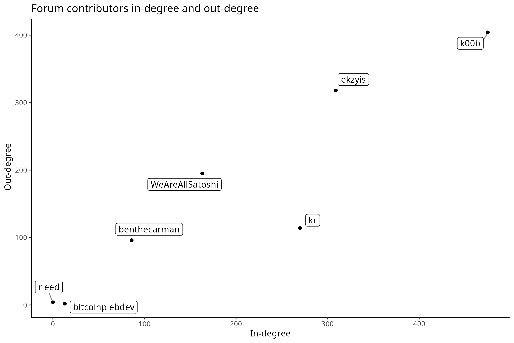

