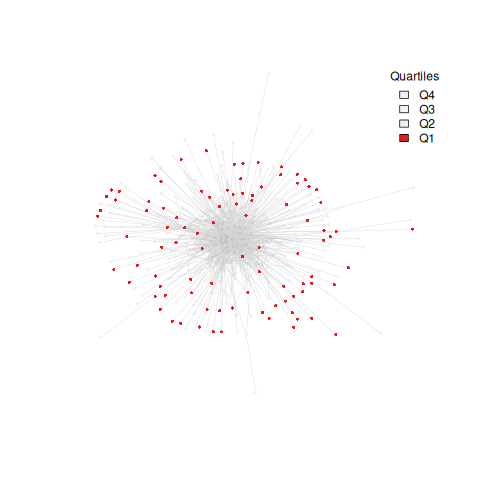
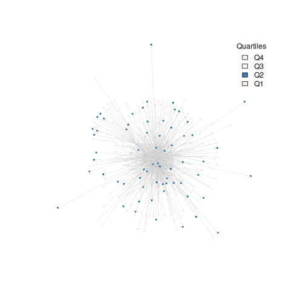
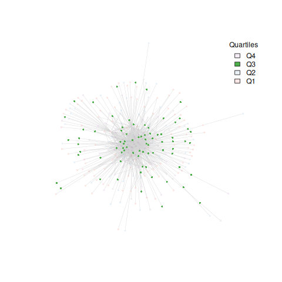
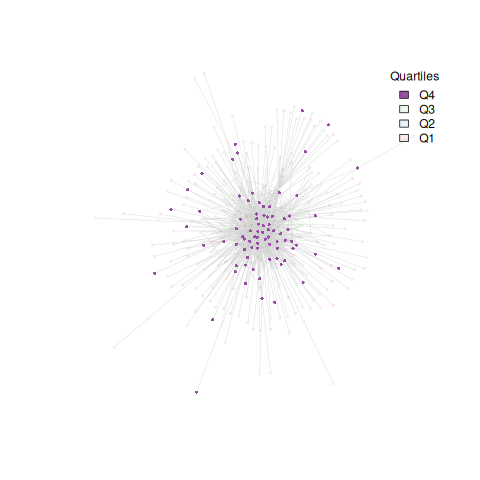
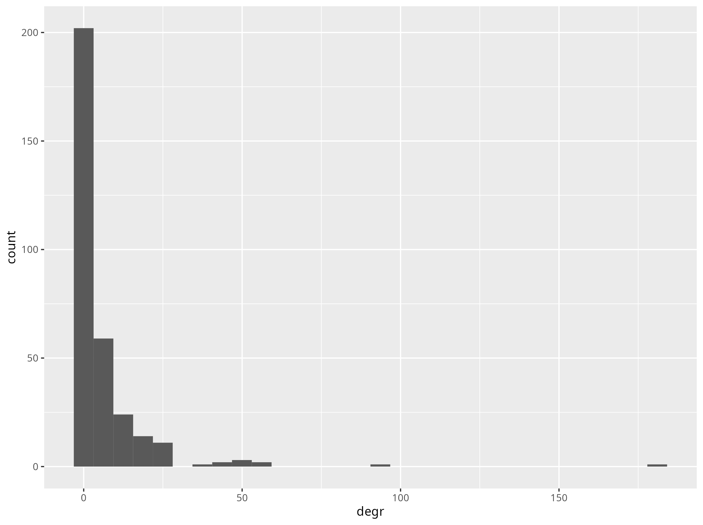
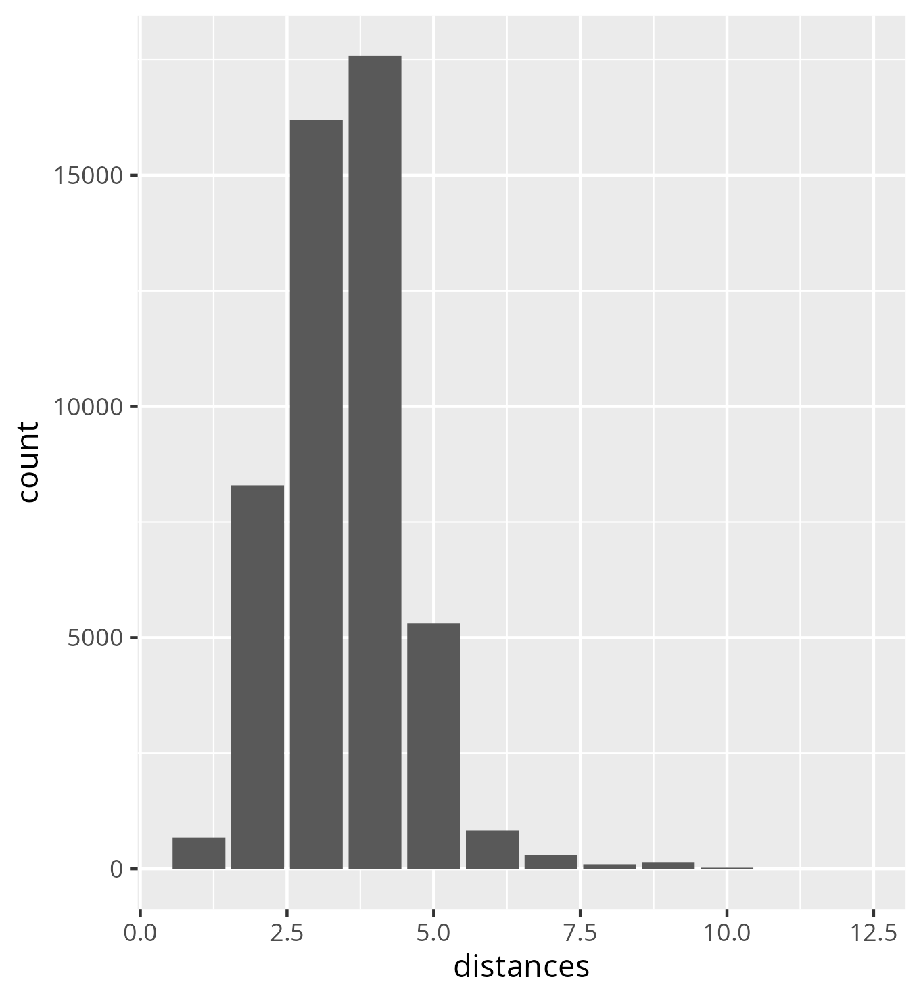

# Social Network Analysis of stacker.news forum

## First period

### Graph

|||
|--------------------------------|--------------------------------|
|||

### Analysis

#### Degree distribution

The following are the top 10 nodes for degree values (without loops).

|     | Author     | Degree |
|-----|------------|--------|
| 1   | k00b       | 181    |
| 2   | nout       | 94     |
| 3   | CypherPoet | 59     |
| 4   | DarthCoin  | 58     |
| 5   | dergigi    | 53     |
| 6   | ugmug      | 51     |
| 7   | relc       | 50     |
| 8   | gmd        | 46     |
| 9   | jimmysong  | 46     |
| 10  | g4ala      | 40     |

-   Mean degree: 6.61875
-   Median degree: 2

The following moderators were active during this time period:

|     | Author       | Degree |
|-----|--------------|--------|
| 1   | k00b         | 181    |
| 2   | kr           | 27     |
| 3   | benthecarman | 1      |

#### Components

The network is divided into 6 components, with a **giant component** composed by 315 nodes and five small components with 1 node each. The components containing only one node are in fact users that posted in the forum without receiving comments. This behaviour can be observed even by looking at the picture about the first period graph, in which some isolated nodes are clearly visible. Some of them ever received a considerable amount of sats for their posts (2 of the 5 are in the 3rd quartile in terms of sats stacked), but their posts didn't trigger any discussion.

Overall the totality of 'Q4' nodes are in the middle of the giant component, meaning that the ones that earned the most are the ones that actually are more engaged in this initial period of the life of the forum.

#### Path

> **NB**: in a weighted graph, distances (and so diameter) are computed using the sum of weights.

-   **Diameter**: the diameter of the graph is 12. On the diameter path there are 6 nodes.

-   **Mean distance**: 3.481387

-   **Median distance**: 3

These values are really close to what was observed by the numerous experiments on the **Small World Phenomenon**. The following is the distribution of degrees of separation:

#### Clustering and partitioning

The following section observes and compares the application of different clustering algorithms, also called 'community detection algorithms'.

The numerical value that describes the network structure community-wise is the so called **modularity**. Community detection algorithms aim to find the division of a network that maximizes its modularity. The following considerations shall be taken into account:

-   Modularity ranges from -1 to 1
-   Higher modularity score suggests a better division of the network into communities
-   Positive values indicate a good community structure
-   Negative values indicate that the network is not well divided into communities

##### Edge betweenness clustering

-   Clustering isolated 36 groups
-   Modularity equal to 0.05 indicates a 'neutral' community structure, meaning that the network is barely divided into communities

##### Louvian clustering

-   Clustering isolated 17
-   Modularity equal to 0.16 indicates a relevant community structure, meaning that the network is divided into communities

##### Walktrap clustering

-   Clustering isolated 169
-   Modularity equal to 0.083 indicates a 'neutral' community structure, meaning that the network is barely divided into communities

##### Fast Greedy clustering

-   Clustering isolated 19
-   Modularity equal to 0.15 indicates a relevant community structure, meaning that the network is divided into communities

##### Leading Eigenvector clustering

-   Clustering isolated 39
-   Modularity equal to 0.12 indicates a relevant community structure, meaning that the network is divided into communities

## Second period
